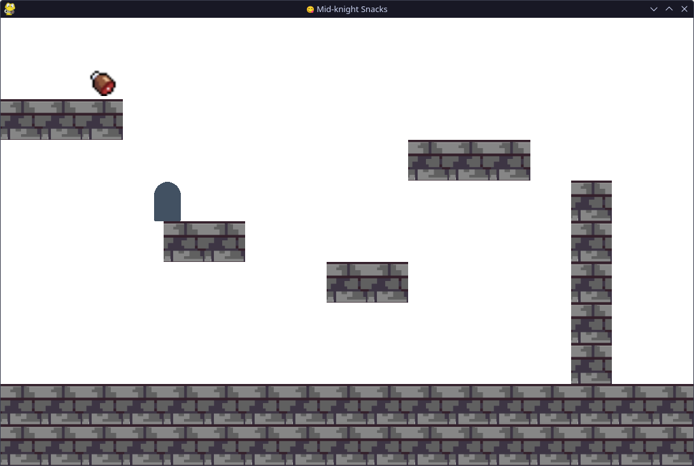

# Mid-Knight Snacks

  
  

A castle- and beef-themed game, made during the [Counterspell](https://counterspell.hackclub.com/) game jam in Autumn 2024.

## How to run the game

1. Clone the repository
2. Create a venv if you want (`python3 -m venv .venv` and `source .venv/bin/activate`)
3. Install Pygame with `python3 -m pip install -r requirements.txt`
4. `python3 main.py`

## Demo video

[Download or view the video (1.5 MB, mp4)](./demos/Mid-Knight%20Snacks.mp4)

<video controls src="demos/Mid-Knight Snacks.mp4" title="Mid-Knight Snacks demo video"></video>

## Screenshot

## Building for the web

Following the [Pygbag documentation](https://pygame-web.github.io/wiki/pygbag/#running-your-project-in-your-own-browser):

1. Install Pygbag: `python3 -m pip install pygbag`
2. Build and serve the game: `python3 -m pygbag .`
3. Visit <http://localhost:8000> in your browser and wait for the game to load

To just build the files without serving them, run `python -m pygbag --build .`

## Credits

Developed by Andrew, Mish and Morgan.
