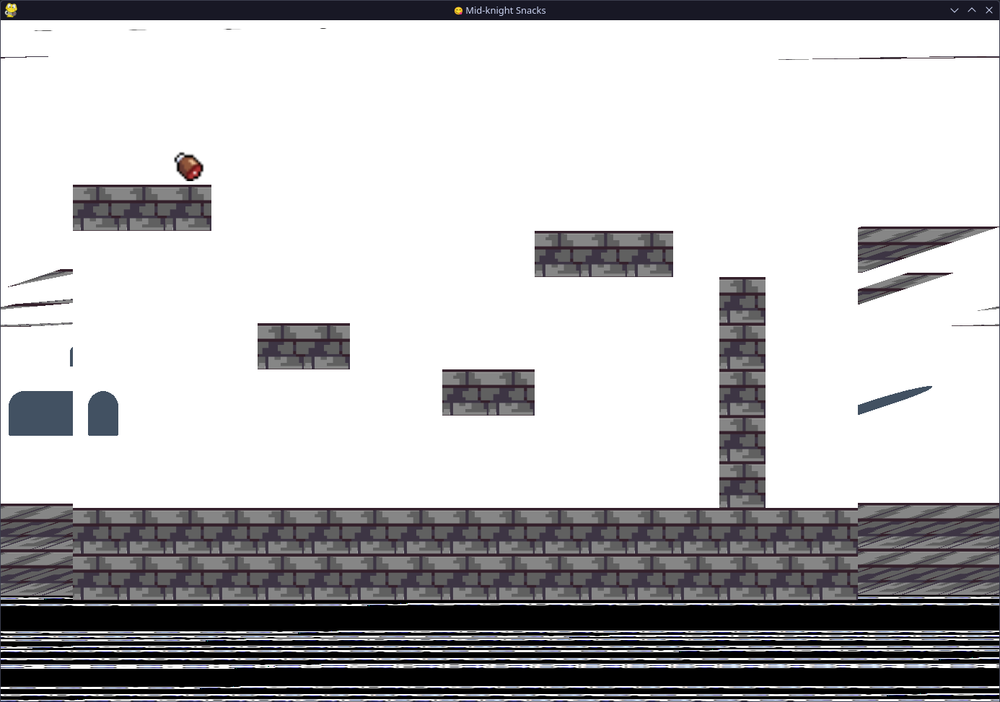

# Mid-Knight Snacks

  
  

A castle- and beef-themed game, made during the [Counterspell](https://counterspell.hackclub.com/) game jam in Autumn 2024.

## How to run the game

### Play it online

Visit **[https://randomsearch18.github.io/mid-knight-snacks](https://randomsearch18.github.io/mid-knight-snacks/)** to play the game in your browser! Keyboard required.

An alternative domain is available: <https://knight.mish.drinks-tea.uk>

### Run it locally

1. Clone the repository
2. Create a venv if you want (`python3 -m venv .venv` and `source .venv/bin/activate`)
3. Install Pygame with `python3 -m pip install -r requirements.txt`
4. `python3 main.py`

## Instructions and lore

Move with <kbd>A</kbd> and <kbd>D</kbd> and use <kbd>Space</kbd> to jump.

You are a very hungry knight in a castle, and you've got to navigate the castle to find the beef that you crave. You know you've won when you become nice and... chubby.

The original idea behind the game was that by completing levels, the player would get larger and more unwieldy, thus making the player their own enemy.

## Improvements made after Counterspell

I focused on improving how the game functioned rather than adding any new gameplay, because my experience with making these changes will be more broadly useful in future games or projects. The important things I did to improve the game were to:

- Fix the _incredibly_ botched Physics logic
  - Turns out that creating something that actually works wasn't too hard, now that I've done it once
- Make the game playable on the web
- Slightly improve how the knight looks (even if he's still a solid-color rectangle)
- Properly handle exiting the game area
  - Including respawning with an animation
  - Previously, the game would softlock if you jumped to far up, and crash if you walked too far right
- Make the game window resizable, and make the level best fit the available space
  - This included rewriting the game to use tiles as a coordinate system (rather than pixels)

## Screenshots

### Epic fails

## Demo video

You can [download or view the demo video (1.5 MB, mp4)](./demos/Mid-Knight%20Snacks.mp4). It shows the game in the state it was in at the end the Counterspell game jam.

<video controls src="demos/Mid-Knight Snacks.mp4" title="Mid-Knight Snacks demo video"></video>

## System requirements

These are the requirements for running the game locally:

- A screen. (At least 1000x800 because the window isn't resizable)
- Windows, Linux, or MacOS
  - Fun fact: during the game jam, we used Windows and MacOS, and further development was done with Linux
- You need a keyboard! Or something that can provide inputs for <kbd>A</kbd>, <kbd>D</kbd>, and <kbd>Space</kbd>
- A modern version of Python. You can probably go down to maybe 3.8, but that hasn't been specifically tested

## Building for the web

Following the [Pygbag documentation](https://pygame-web.github.io/wiki/pygbag/#running-your-project-in-your-own-browser):

1. Install Pygbag: `python3 -m pip install pygbag`
2. Build and serve the game: `python3 -m pygbag .`
3. Visit <http://localhost:8000> in your browser and wait for the game to load

To just build the files without serving them, run `python -m pygbag --build .`

## Credits

Developed by the dream team of Andrew, Mish and Morgan during Counterspell. Enhanced by Mish after the game jam.

Made using [Pygame](https://www.pygame.org/), with [Pygbag](https://pygame-web.github.io/wiki/pygbag/) for the web distribution.
